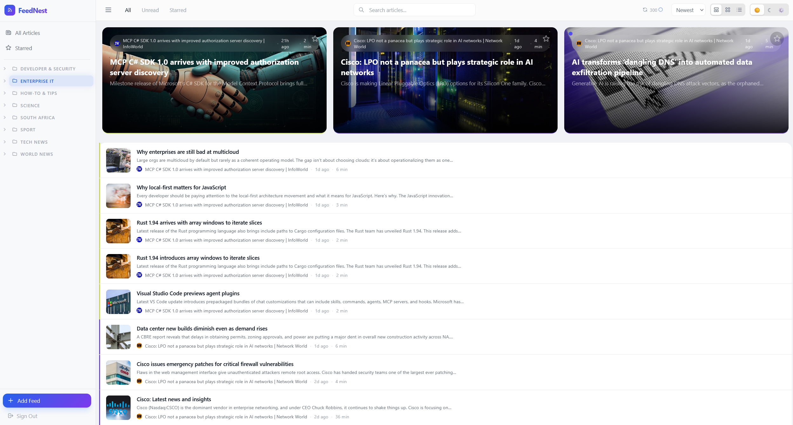
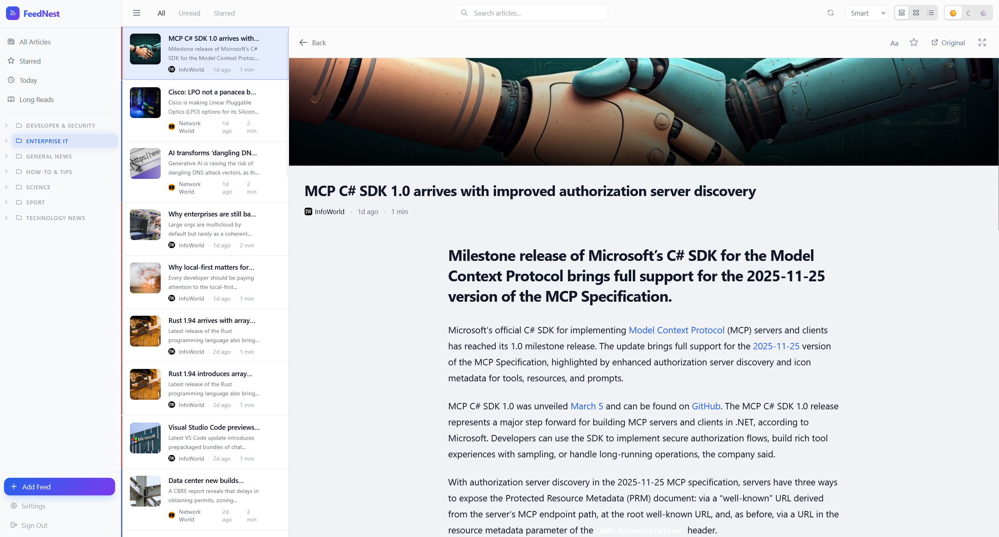
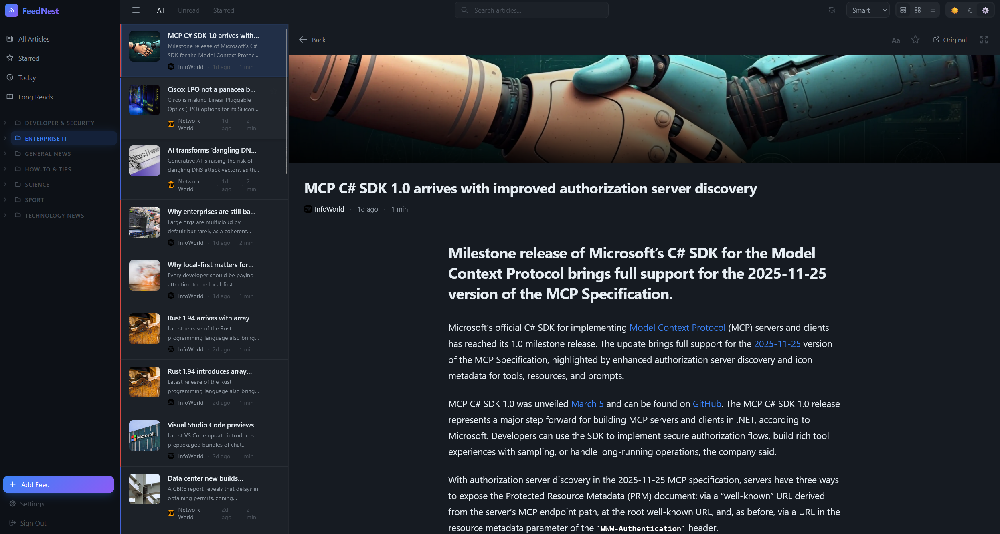

<div align="center">


<br/>
<br/>

[](https://go.dev)
[](https://svelte.dev)
[](https://sqlite.org)
[](https://docker.com)
[](LICENSE)

**A blazing-fast, self-hosted RSS reader with a stunning glassmorphic UI,<br/>smart article ranking, and a reading experience that puts content first.**

No tracking. No ads. No algorithms deciding what you see.

[Quick Start](#-quick-start) · [Features](#-features) · [Shortcuts](#-keyboard-shortcuts) · [Tech Stack](#-tech-stack) · [Development](#-development)

</div>

---

<br/>



<p align="center">


</p>

<br/>

## Why FeedNest?

Most RSS readers feel like they stopped evolving in 2010. FeedNest brings a modern, Feedly-inspired experience to self-hosting — built on **glassmorphism**, **gradient accents**, and **buttery-smooth spring animations**. It's the reading experience you deserve, on infrastructure you control.

<br/>

## 🚀 Quick Start

```bash
git clone https://github.com/Swaeltjie/feednest.git
cd feednest
docker compose up -d
```

Open **http://localhost:3000**, create your account, and start reading. That's it.

<br/>

## ✨ Features

<table>
<tr><td>

### 📖 Reading Experience

- **Inline reading pane** — split-pane layout keeps the article list visible while you read
- **Focus mode** — press `f` to go full-width for distraction-free reading
- **Three view modes** — Hybrid (hero cards + dense list), Card grid, or compact List
- **Smart ranking** — articles scored by recency (60%) and engagement (40%) with exponential decay
- **Customizable reader** — font size, font family, line height, and content width
- **Content extraction** — pulls full articles even from summary-only feeds
- **Reading progress bar** — gradient bar tracks your scroll position
- **Personalized reading time** — learns your reading speed from actual behavior
- **Article navigation** — `j`/`k` to move between articles without closing the reader

</td></tr>
<tr><td>

### 🧘 Wellbeing & Calm Design

- **Calm mode** — hides unread badges to reduce notification anxiety (on by default)
- **Content aging** — old unread articles visually fade, signaling "it's OK to skip these"
- **Catch-up** — mark older articles as read or keep only the newest N per feed
- **No dark patterns** — no streaks, no FOMO notifications, no engagement-maximizing tricks

</td></tr>
<tr><td>

### 🗂 Organization

- **Categories & tags** — drag-and-drop categories, rename feeds/categories inline, tag articles
- **Smart feeds** — Starred, Today (last 24h), and Long Reads (10+ min) built-in views
- **Filter rules** — hide, auto-read, or auto-star articles by title, author, or content (regex supported)
- **Cross-feed deduplication** — same article in multiple feeds? You'll only see it once
- **Ad filtering** — automatically hides sponsored posts and bot-protection pages
- **OPML import/export** — migrate from any reader in seconds

</td></tr>
<tr><td>

### 🎨 Interface

- **Glassmorphic design** — frosted glass toolbars, gradient accents, adaptive dark/light themes
- **Command palette** — `Ctrl+K` for everything: navigation, views, sorting, feeds, actions
- **Full-text search** — instant debounced search across all articles
- **Keyboard-first** — vim-style navigation, chord sequences (`gg`, `G`), single-key actions
- **Spring animations** — physics-based motion with staggered entrances and parallax effects
- **Dynamic feed colors** — accent colors extracted from feed favicons
- **Mobile gestures** — swipe right to mark read, swipe left to star
- **Responsive** — phones to ultra-wides

</td></tr>
<tr><td>

### 🔒 Self-Hosting Done Right

- **Single binary + SQLite** — no Postgres, no Redis, no external dependencies
- **Multi-user** — JWT auth with automatic token refresh and auto-generated secrets
- **Rate limiting** — per-IP auth rate limiting with trusted proxy support
- **SSRF protection** — blocks requests to private/internal networks
- **XSS protection** — article content sanitized with DOMPurify
- **Full REST API** — Swagger UI included at `/api/docs`

</td></tr>
</table>

<br/>

## ⌨️ Keyboard Shortcuts

| Key | Action |
|:---:|--------|
| `j` / `k` | Navigate down / up |
| `Enter` | Open article |
| `Escape` | Close reader |
| `s` | Toggle star |
| `m` | Toggle read/unread |
| `d` | Dismiss article |
| `f` | Toggle focus mode |
| `v` | Cycle view mode |
| `1` `2` `3` | Hybrid / Cards / List |
| `g g` | Jump to top |
| `G` | Jump to bottom |
| `/` | Focus search |
| `r` | Refresh feeds |
| `Ctrl+K` | Command palette |
| `?` | Show all shortcuts |

<br/>

## 🛠 Tech Stack

| | Technology | Purpose |
|---|-----------|---------|
| ⚡ | **SvelteKit 5** + Svelte 5 Runes | Reactive frontend with TypeScript |
| 🎨 | **Tailwind CSS 4** | Utility-first styling with glassmorphism |
| 🚀 | **Go 1.26** + Chi router | Fast, lightweight API server |
| 💾 | **SQLite** (WAL mode) | Zero-config embedded database |
| 📡 | **gofeed** + go-readability | RSS/Atom parsing + content extraction |
| 🔐 | **JWT** (HS256) | Stateless auth with refresh tokens |
| 🐳 | **Docker Compose** | One-command deployment |
| 🛡 | **DOMPurify** | XSS-safe article rendering |

<br/>

## 💻 Development

See [docs/development.md](docs/development.md) for local setup, project structure, and API reference.

```bash
# Docker (recommended)
docker compose up --build -d     # Build and run
docker compose logs -f           # Watch logs
docker compose down              # Stop

# Local dev
cd backend && go run ./cmd/feednest/       # Backend on :8082
cd frontend && npm install && npm run dev  # Frontend on :5173 with HMR
```

### Environment Variables

| Variable | Default | Description |
|----------|---------|-------------|
| `PORT` | `8080` | Backend listen port |
| `DB_PATH` | `./feednest.db` | SQLite database path |
| `JWT_SECRET` | *auto-generated* | JWT signing key — auto-generated and persisted if not set |
| `ORIGIN` | `http://localhost:3000` | SvelteKit origin (CSRF) |
| `TRUSTED_PROXY_IPS` | — | Comma-separated IPs of trusted reverse proxies (enables X-Forwarded-For) |
| `ALLOWED_ORIGINS` | `localhost:5173,localhost:3000` | CORS allowed origins (comma-separated) |

<br/>

## 🤝 Contributing

See [CONTRIBUTING.md](CONTRIBUTING.md) for development setup, code style, and PR guidelines.

## 🔐 Security

See [SECURITY.md](SECURITY.md) for vulnerability reporting and security measures.

---

<div align="center">

**Built with obsessive attention to detail.**

<sub>GPL-3.0 License</sub>

</div>
