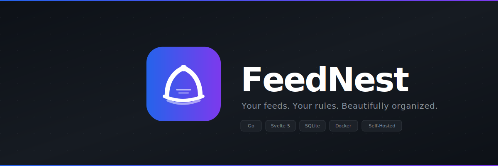

<div align="center">



<br/>
<br/>

[](https://go.dev)
[](https://svelte.dev)
[](https://sqlite.org)
[](https://docker.com)
[](LICENSE)

**A blazing-fast, self-hosted RSS reader with a stunning glassmorphic UI,<br/>smart article ranking, and a reading experience that puts content first.**

No tracking. No ads. No algorithms deciding what you see.

[Quick Start](#quick-start) ·
[Features](#features) ·
[Keyboard Shortcuts](#keyboard-shortcuts) ·
[Tech Stack](#tech-stack) ·
[Development](#development)

---

</div>

## Why FeedNest?

Most RSS readers feel like they stopped evolving in 2010. FeedNest brings a modern, Feedly-inspired experience to self-hosting — built on **glassmorphism**, **gradient accents**, and **buttery-smooth animations**. It's the reading experience you deserve, on infrastructure you control.

<br/>

## Quick Start

```bash
git clone https://github.com/Swaeltjie/feednest.git
cd feednest
docker compose up -d
```

Open **http://localhost:3000**, create your account, and add your first feed. That's it.

> **Tip:** Set `JWT_SECRET` to something secure in your environment before deploying.

<br/>

## Features

### Reading Experience

- **Inline reading pane** — split-pane layout keeps article list visible while you read
- **Focus mode** — press `f` to hide the list and go full-width for distraction-free reading
- **Three view modes** — Hybrid (hero cards + dense list), Card grid, or compact List
- **Smart prioritization** — articles scored by your reading patterns, not engagement bait
- **Beautiful typography** — tuned prose with proper headings, blockquote accents, and code formatting
- **Content extraction** — pulls full articles even from summary-only feeds using readability
- **Reading progress bar** — gradient bar tracks your scroll position through the article

### Organization

- **Categories & tags** — drag-and-drop categories, tag individual articles
- **Inline category creation** — new categories right from the "Add Feed" modal
- **Cross-feed deduplication** — same article in multiple feeds? You'll only see it once
- **Ad filtering** — automatically hides sponsored posts and bot-protection pages

### Interface

- **Glassmorphic design** — frosted glass toolbars, gradient accents, adaptive dark/light themes
- **Full-text search** — instant debounced search across all article titles and content
- **Live refresh timer** — animated countdown ring shows next auto-refresh (click to refresh now)
- **Keyboard-first** — vim-style navigation, command palette (`Ctrl+K`), chord sequences (`gg`)
- **Command palette** — fuzzy search across feeds, categories, and actions
- **Spring animations** — physics-based motion system with staggered entrances
- **Responsive** — works beautifully from phones to ultra-wides

### Self-Hosting Done Right

- **Single binary + SQLite** — no Postgres, no Redis, no external dependencies
- **Multi-user** — JWT auth with automatic token refresh
- **OPML import/export** — migrate from any reader in seconds
- **SSRF protection** — blocks requests to private/internal networks
- **XSS protection** — article content sanitized with DOMPurify
- **Security headers** — X-Frame-Options, nosniff, referrer policy out of the box
- **Full REST API** — Swagger UI included at `/api/docs`

<br/>

## Keyboard Shortcuts

| Key | Action |
|:---:|--------|
| `j` / `k` | Navigate down / up |
| `Enter` | Open article |
| `Escape` | Close reader |
| `s` | Toggle star |
| `m` | Toggle read/unread |
| `d` | Dismiss |
| `f` | Toggle focus mode |
| `v` | Cycle view mode |
| `1` / `2` / `3` | Hybrid / Cards / List view |
| `g g` | Jump to first article |
| `G` | Jump to last article |
| `/` | Focus search |
| `r` | Refresh feeds |
| `Ctrl+K` | Command palette |
| `?` | Keyboard shortcuts help |

See [docs/keyboard-shortcuts.md](docs/keyboard-shortcuts.md) for the full reference.

<br/>

## Tech Stack

| | Technology | Purpose |
|-|-----------|---------|
| | **SvelteKit 5** + Svelte 5 Runes | Reactive frontend with TypeScript |
| | **Tailwind CSS 4** | Utility-first styling with glassmorphism |
| | **Go** + Chi router | Fast, lightweight API server |
| | **SQLite** (WAL mode) | Zero-config embedded database |
| | **gofeed** + go-readability | RSS/Atom parsing + content extraction |
| | **JWT** (HS256) | Stateless auth with refresh tokens |
| | **Docker Compose** | One-command deployment |
| | **DOMPurify** | XSS-safe article rendering |

<br/>

## Development

### Prerequisites

- **Go 1.26+** and **Node 24+** for local dev
- **Docker** for containerized deployment

### Local Development

```bash
# Backend — runs on :8082
cd backend && go run ./cmd/feednest/

# Frontend — runs on :5173 with HMR
cd frontend && npm install && npm run dev
```

### Docker

```bash
docker compose up --build -d     # Build and run
docker compose logs -f           # Watch logs
docker compose down              # Stop
```

### Project Structure

```
feednest/
├── backend/
│   ├── cmd/feednest/             # Entry point
│   └── internal/
│       ├── api/                  # Routes, auth, middleware, Swagger
│       │   └── handlers/         # Request handlers
│       ├── fetcher/              # RSS/Atom feed fetcher
│       ├── readability/          # Full content extraction
│       ├── scheduler/            # Background refresh
│       ├── scorer/               # Smart article ranking
│       ├── urlutil/              # SSRF protection
│       └── store/                # SQLite data layer
├── frontend/
│   └── src/
│       ├── lib/
│       │   ├── api/              # HTTP client with token refresh
│       │   ├── components/       # Svelte 5 components
│       │   ├── stores/           # Reactive state management
│       │   └── utils/            # Helpers (time, favicon, keyboard)
│       └── routes/               # SvelteKit pages
├── assets/                       # Logo and banner SVGs
└── docker-compose.yml
```

<br/>

## Environment Variables

| Variable | Default | Description |
|----------|---------|-------------|
| `JWT_SECRET` | `change-me-in-production` | **Set this.** JWT signing key. |
| `PORT` | `8080` | Backend listen port |
| `DB_PATH` | `./feednest.db` | SQLite database path |
| `ORIGIN` | `http://localhost:3000` | SvelteKit origin (CSRF) |

<br/>

---

<div align="center">

**Built with obsessive attention to detail.**

<sub>GPL-3.0 License</sub>

</div>
